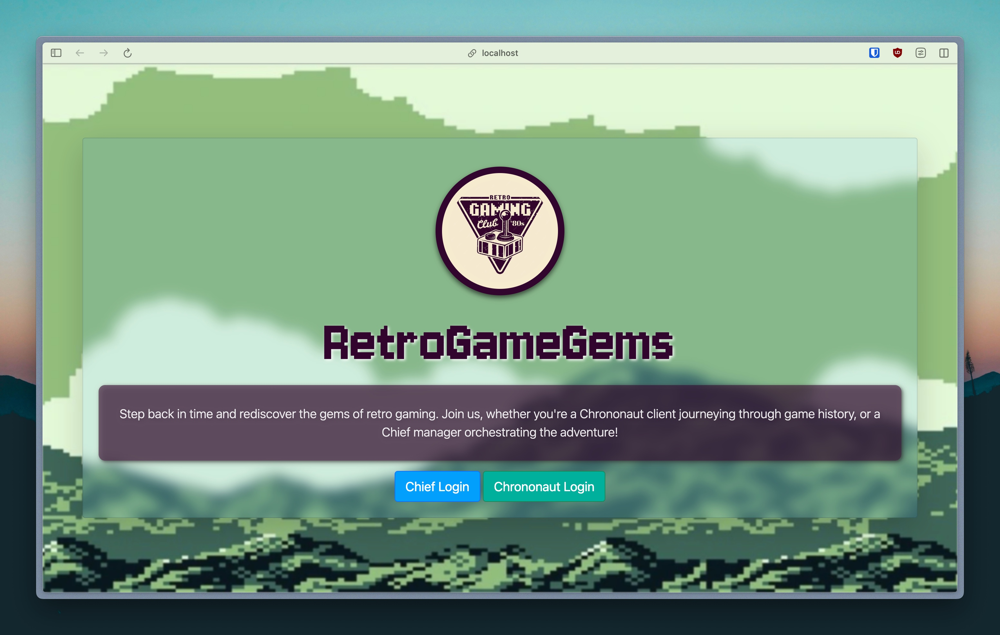

# PW6-2023-24-RS

### Sommaire

1. [Cadre du projet](#cadre-du-projet)
2. [Objectif](#objectif)
3. [Contributeurs](#contributeurs)
4. [Installation](#installation)
5. [Utilisation](#utilisation)
6. [Initialisation de la base de données](#initialisation-de-la-base-de-données)
7. [Pour voir la base de données postgres](#pour-voir-la-base-de-données-postgres)
8. [Captures d'écran du projet](#captures-décran-du-projet)

### Cadre du projet

Projet en binôme pour le cours de Programmation Web du semestre 6 en 2023-2024 à l'Université Paris Cité (Campus Grands Moulins).

### Objectif

[sujet du projet](sujet.pdf)

### Contributeurs

| Nom        | Prénom   | pseudo    | Numéro d'étudiant |
| ---------- | -------- | --------- | ----------------- |
| RAOUL      | Théo     | @raoul    | 71707138          |
| SELVAKUMAR | MATHUSAN | @selvakum | 22112498          |

### Installation

1. Cloner le dépôt
2. Installer les dépendances

```bash
npm install express ejs bcryptjs express-session connect-pg-simple pg dotenv http-status-codes multer sharp csv-parser
```

3. Créez l'utilisateur et la base de données nécessaires pour le projet

```bash
psql -U postgres
```

```sql
CREATE ROLE myuser LOGIN PASSWORD 'mypassword';
CREATE DATABASE loyalty_card_db WITH OWNER = myuser;
```

4. Lancez le script de l'initialisation de la base de données

```bash
node db_setup.js
```

### Utilisation

1. Lancer le serveur

```bash
npm start
```

2. Ouvrir un navigateur et aller à l'adresse [`http://localhost:3000`](http://localhost:3000)

### Initialisation de la base de données

Pour accéder à l'interface d'administration, il faut se connecter avec les identifiants suivants :

| email              | password | first_name | last_name  |
| ------------------ | -------- | ---------- | ---------- |
| rtheo@mail.com     | theo     | Theo       | Raoul      |
| smathusan@mail.com | mathusan | Mathusan   | Selvakumar |

Pour ajouter un nouvel administrateur, il faut ajouter un enregistrement dans la table `admin` de la base de données ou utiliser le script `db_setup.js` après avoir modifié le fichier `db_setup.js` en ajoutant un nouvel administrateur dans la liste `admins`.

Lors de l'initialisation de la base de données, les clients suivants sont ajoutés :

| last_name | first_name | email                  | password   | points | birth_date   |
| --------- | ---------- | ---------------------- | ---------- | ------ | ------------ |
| Doe       | John       | john.doe@mail.com      | john123    | 1210   | CURRENT_DATE |
| Smith     | Jane       | jane.smith@mail.com    | jane123    | 750    | CURRENT_DATE |
| Jones     | Alice      | alice.jones@mail.com   | alice123   | 500    | CURRENT_DATE |
| Brown     | Bob        | bob.brown@mail.com     | bob123     | 3140   | CURRENT_DATE |
| Davis     | Charlie    | charlie.davis@mail.com | charlie123 | 1050   | CURRENT_DATE |

La date de naissance (`birth_date`) est initialisée à la date courante pour tous les clients pour des raisons de démonstration.

### Pour voir la base de données postgres

```bash
psql -U myuser -d loyalty_card_db
```

### Captures d'écran du projet

<table align="center" style="width:1200px; table-layout: fixed;">
  <tr>
    <td colspan="4">
      <figure>
        
        <figcaption style="text-align:center;">Bienvenue sur notre page d'accueil</figcaption>
      </figure>
    </td>
  </tr>
  <tr>
    <td colspan="2">
      <figure>
        
        <figcaption style="text-align:center;">Page de connexion du client</figcaption>
      </figure>
    </td>
    <td colspan="2">
      <figure>
        
        <figcaption style="text-align:center;">Page de connexion de la gérante</figcaption>
      </figure>
    </td>
  </tr>
  <tr><td colspan="4" style="height: 30px;"></td></tr> <!-- Spacer Row -->
  <tr>
    <td colspan="4">
      <figure>
        
        <figcaption style="text-align:center;">Tableau de bord du client - Notifications d'anniversaire</figcaption>
      </figure>
    </td>
  </tr>
  <tr>
    <td colspan="2">
      <figure>
        
        <figcaption style="text-align:center;">Vue d'ensemble de vos transactions</figcaption>
      </figure>
    </td>
    <td colspan="2">
      <figure>
        
        <figcaption style="text-align:center;">Parcourir les cadeaux disponibles</figcaption>
      </figure>
    </td>
  </tr>
  <tr>
    <td colspan="2">
      <figure>
        
        <figcaption style="text-align:center;">Détails du panier d'achat</figcaption>
      </figure>
    </td>
    <td colspan="2">
      <figure>
        
        <figcaption style="text-align:center;">Page de confirmation de la commande</figcaption>
      </figure>
    </td>
  </tr>
  <tr><td colspan="4" style="height: 30px;"></td></tr> <!-- Spacer Row -->
  <tr>
    <td colspan="4">
      <figure>
        
        <figcaption style="text-align:center;">Tableau de bord principal de la gérante</figcaption>
      </figure>
    </td>
  </tr>
  <tr>
    <td colspan="2">
      <figure>
        
        <figcaption style="text-align:center;">Page de gestion des clients</figcaption>
      </figure>
    </td>
    <td colspan="2">
      <figure>
        
        <figcaption style="text-align:center;">Page de gestion des cadeaux</figcaption>
      </figure>
    </td>
  </tr>
</table>
