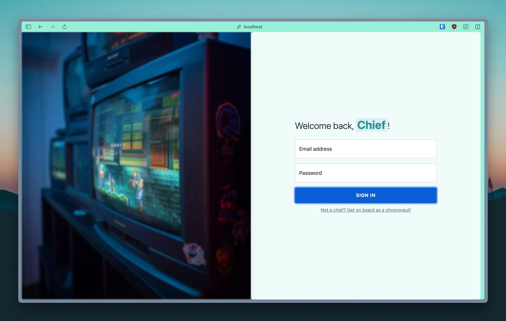
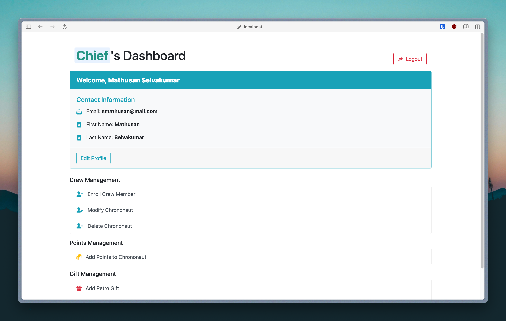

# RetroGameGems

### Table of contents

1. [Project context](#project-context)
2. [Contributors](#contributors)
3. [My contributions](#my-contributions)
4. [Screenshots](#screenshots)
5. [Installation](#installation)
6. [Usage](#usage)
7. [Initialisation of the database](#initialisation-of-the-database)
8. [To see the postgres database](#to-see-the-postgres-database)

### Project context

Pair project for Semester 6 Web Programming course in 2023-2024 at Université Paris Cité (Campus Grands Moulins). The project is about creating a loyalty card system for a retro video game store. The project is divided into two parts: the client side and the manager side. The client side allows customers to view their transactions, points, and available gifts. The manager side allows the manager to manage clients, gifts, and transactions.

This project is developed using the following technologies:

- Front-end: HTML, CSS, JavaScript, EJS, Bootstrap
- Back-end: Node.js, Express.js
- Database: PostgreSQL

### Contributors

| Nom        | Prénom   |
| ---------- | -------- |
| RAOUL      | Théo     |
| SELVAKUMAR | MATHUSAN |

### My contributions

- [x] Project setup
- [x] Database setup
- [x] Home page (Front-end and Back-end)
- [x] Client login page (Front-end and Back-end)
- [x] Manager login page (Front-end and Back-end)
- [x] Client dashboard (Front-end and ~~Back-end~~)
- [x] Manager dashboard (Front-end and Back-end)

### Screenshots

<table align="center" style="width:1200px; table-layout: fixed;">
  <tr>
    <td colspan="4">
      <figure>
        
        <figcaption align="center">Welcome to Retro Game Gems</figcaption>
      </figure>
    </td>
  </tr>
  <tr>
    <td colspan="2">
      <figure>
        
        <figcaption align="center">Client login page</figcaption>
      </figure>
    </td>
    <td colspan="2">
      <figure>
        
        <figcaption align="center">Manager login page</figcaption>
      </figure>
    </td>
  </tr>
  <tr><td colspan="4" style="height: 30px;"></td></tr> <!-- Spacer Row -->
  <tr>
    <td colspan="4">
      <figure>
        
        <figcaption align="center">Client dashboard on birthday</figcaption>
      </figure>
    </td>
  </tr>
  <tr>
    <td colspan="2">
      <figure>
        
        <figcaption align="center">Client transactions</figcaption>
      </figure>
    </td>
    <td colspan="2">
      <figure>
        
        <figcaption align="center">Available gifts</figcaption>
      </figure>
    </td>
  </tr>
  <tr>
    <td colspan="2">
      <figure>
        
        <figcaption align="center">Shopping cart</figcaption>
      </figure>
    </td>
    <td colspan="2">
      <figure>
        
        <figcaption align="center">Order confirmation</figcaption>
      </figure>
    </td>
  </tr>
  <tr><td colspan="4" style="height: 30px;"></td></tr> <!-- Spacer Row -->
  <tr>
    <td colspan="4">
      <figure>
        
        <figcaption align="center">Manager dashboard</figcaption>
      </figure>
    </td>
  </tr>
  <tr>
    <td colspan="2">
      <figure>
        
        <figcaption align="center">Client management page</figcaption>
      </figure>
    </td>
    <td colspan="2">
      <figure>
        
        <figcaption align="center">Gift management page</figcaption>
      </figure>
    </td>
  </tr>
</table>

### Installation

1. Clone the repository

```bash
git clone git@github.com:mathusanm6/RetroGameGems.git
```

2. Install the dependencies

```bash
npm install express ejs bcryptjs express-session connect-pg-simple pg dotenv http-status-codes multer sharp csv-parser
```

3. Create the database and the user needed for the project

```bash
psql -U postgres
```

```sql
CREATE ROLE myuser LOGIN PASSWORD 'mypassword';
CREATE DATABASE loyalty_card_db WITH OWNER = myuser;
```

4. Launch the database setup script

```bash
node db_setup.js
```

### Usage

1. Launch the server

```bash
npm start
```

2. Open a web browser and go to [`http://localhost:3000`](http://localhost:3000)

### Initialisation of the database

To access the manager dashboard, you need to log in as an administrator. The following administrators are added to the database:

| email              | password | first_name | last_name  |
| ------------------ | -------- | ---------- | ---------- |
| rtheo@mail.com     | theo     | Theo       | Raoul      |
| smathusan@mail.com | mathusan | Mathusan   | Selvakumar |

To add a new administrator, you need to add a record in the `admin` table of the database or use the `db_setup.js` script after modifying the `db_setup.js` file by adding a new administrator to the `admins` list.

When initializing the database, the following clients are added:

| last_name | first_name | email                  | password   | points | birth_date   |
| --------- | ---------- | ---------------------- | ---------- | ------ | ------------ |
| Doe       | John       | john.doe@mail.com      | john123    | 1210   | CURRENT_DATE |
| Smith     | Jane       | jane.smith@mail.com    | jane123    | 750    | CURRENT_DATE |
| Jones     | Alice      | alice.jones@mail.com   | alice123   | 500    | CURRENT_DATE |
| Brown     | Bob        | bob.brown@mail.com     | bob123     | 3140   | CURRENT_DATE |
| Davis     | Charlie    | charlie.davis@mail.com | charlie123 | 1050   | CURRENT_DATE |

The birth date (`birth_date`) is set to `CURRENT_DATE` to simulate the birthday of the clients. The `points` field is initialized with random values.

### To see the postgres database

```bash
psql -U myuser -d loyalty_card_db
```
